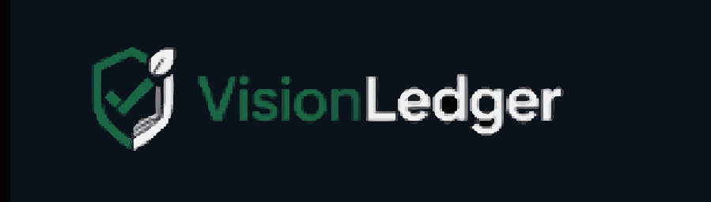

# 🌍 VisionLedger

<p align="center">
  
</p>

<p align="center">
  <b>AI-Powered Environmental Verification Platform with Blockchain Proof</b>
</p>

<p align="center">
  
  
  
  
  
  
</p>

---

> **AI-Powered Environmental Verification Platform with Blockchain Proof**

VisionLedger is an enterprise-grade verification platform...

# 🌍 VisionLedger

> **AI-Powered Environmental Verification Platform with Blockchain Proof**

VisionLedger is an enterprise-grade verification platform that combines **Artificial Intelligence** and **Blockchain Technology** to verify environmental, ESG, and infrastructure claims with immutable on-chain proof.

Instead of relying on trust, VisionLedger provides **AI-powered evidence analysis**, **blockchain-backed verification**, and **tamper-proof digital certificates** for sustainability reporting, compliance, and impact verification.

---

## ✨ Features

### 🤖 AI Verification
- AI-powered image analysis using **Fireworks AI (Qwen 3.7 Plus)**
- Intelligent evidence verification
- Multi-stage confidence scoring
- Context-aware reasoning
- Object detection with confidence values

### 📊 Multi-Score Confidence Engine
VisionLedger evaluates every submission using three independent confidence metrics:

- 👁 **Vision Confidence** – Image quality and object detection certainty
- 🎯 **Claim Match Confidence** – How well the image supports the selected claim
- ✅ **Verification Confidence** – Final AI verification score

---

### 🌱 Supported Verification Categories

- 🌳 Tree Plantation
- ☀️ Solar Installation
- 🏗 Construction Progress
- 🚚 Package Delivery
- ♻️ Waste Processing
- 🏢 Infrastructure Inspection
- 🌾 Agricultural Monitoring
- 🌊 Water Body Monitoring

---

### ⛓ Blockchain Verification

Every successful verification is anchored onto the **Ethereum Sepolia Testnet**.

Stored blockchain information includes:

- Verification Hash
- Transaction Hash
- Block Number
- Network
- Smart Contract Address
- Verification Timestamp

Users can verify every transaction directly on **Etherscan**.

---

### 📜 Professional Verification Certificates

Automatically generates branded PDF certificates containing:

- VisionLedger Branding
- AI Verification Summary
- Blockchain Proof
- QR Code
- Transaction Hash
- Verification Details
- Digital Signature Section

---

### 🔐 Authentication

Secure authentication powered by **Supabase Auth**

Supports:

- Email & Password
- Google Sign-In
- Email Verification
- Password Reset
- Protected Routes
- Session Persistence

---

### 👤 User Ownership & Security

- User-specific verification history
- Row Level Security (RLS)
- Protected APIs
- JWT Authentication
- Secure access to reports and certificates

Each user can only access their own verification records.

---

### 📱 Progressive Web App (PWA)

- Installable on desktop and mobile
- Offline support
- Service Worker
- Responsive UI
- Native app-like experience

---

## 🛠 Tech Stack

### Frontend

- React
- TypeScript
- Vite
- Tailwind CSS
- Framer Motion
- React Router

### Backend

- FastAPI
- Python
- Supabase
- Web3.py
- ReportLab

### AI

- Fireworks AI
- Qwen 3.7 Plus

### Blockchain

- Ethereum Sepolia
- Solidity
- Hardhat

### Database

- Supabase PostgreSQL

### Authentication

- Supabase Auth
- Google OAuth

---

# 🏗 Architecture

```
                User
                  │
                  ▼
          React Frontend (PWA)
                  │
                  ▼
           FastAPI Backend
                  │
      ┌───────────┼───────────┐
      ▼           ▼           ▼
 Fireworks AI  Supabase   Ethereum
   (Qwen)     Database     Sepolia
      │           │           │
      └──────► Verification ◄─┘
                  │
                  ▼
       Blockchain Certificate
```

---

# 🔄 Verification Workflow

```
User Login
      │
      ▼
Upload Evidence
      │
      ▼
AI Analysis
      │
      ▼
Object Detection
      │
      ▼
Multi-Score Confidence Analysis
      │
      ▼
Blockchain Verification
      │
      ▼
Supabase Storage
      │
      ▼
Professional Certificate Generation
      │
      ▼
Verification History
```

---

# 📈 AI Confidence System

VisionLedger evaluates every submission using three independent metrics:

| Score | Description |
|--------|-------------|
| 👁 Vision Confidence | Image quality and AI detection certainty |
| 🎯 Claim Match Confidence | How strongly the evidence supports the selected claim |
| ✅ Verification Confidence | Final verification score shown to users |

Verification Status:

| Confidence | Status |
|------------|--------|
| 90–100 | ✅ Verified |
| 75–89 | 🟢 Likely Verified |
| 50–74 | 🟡 Needs Review |
| 25–49 | 🟠 Inconclusive |
| 0–24 | 🔴 Rejected |

---

# 🔒 Security Features

- JWT Authentication
- Google OAuth
- Email Verification
- Protected API Routes
- Row Level Security (RLS)
- Blockchain Proof
- User Ownership
- Secure Certificate Generation

---

# 🚀 Performance

- Optimized Vite Build
- Route-Level Code Splitting
- Lazy Loading
- Optimized SVG Assets
- Progressive Web App
- Responsive Design

---

# 📂 Project Structure

```
VisionLedger/
│
├── src/
│   ├── components/
│   ├── pages/
│   ├── contexts/
│   ├── lib/
│   └── types/
│
├── backend/
│   ├── app/
│   ├── services/
│   ├── api/
│   ├── migrations/
│   └── schemas/
│
├── blockchain/
│   ├── contracts/
│   ├── scripts/
│   └── tests/
│
└── public/
```

---

# ⚙ Environment Variables

### Frontend

```env
VITE_SUPABASE_URL=
VITE_SUPABASE_ANON_KEY=
VITE_API_URL=
```

### Backend

```env
SUPABASE_URL=
SUPABASE_SERVICE_KEY=
FIREWORKS_API_KEY=
SEPOLIA_RPC_URL=
PRIVATE_KEY=
CONTRACT_ADDRESS=
```

---

# 🖥 Running Locally

### Frontend

```bash
npm install
npm run dev
```

### Backend

```bash
cd backend

python -m venv .venv

.venv\Scripts\activate

pip install -r requirements.txt

uvicorn app.main:app --reload
```

---

# 🌟 Future Improvements

- Multi-image verification
- Video verification
- Satellite imagery analysis
- Organization workspaces
- ESG analytics dashboard
- Batch verification
- Carbon credit integrations
- Multi-chain support
- Real-time monitoring

---

# 👨‍💻 Team

**VisionLedger**

AI-Powered Environmental Verification Platform

Built for the **AMD Developer Hackathon**.

---

# 📄 License

This project is intended for educational, research, and hackathon purposes.

---

## ⭐ If you like this project, consider giving it a star!
